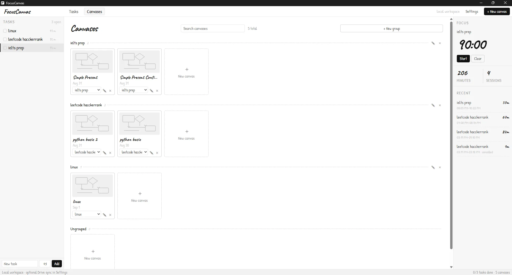

# FocusCanvas

A local-first Windows desktop workspace for tasks, focus sessions, and visual thinking with Excalidraw.

FocusCanvas keeps the working copy in local SQLite and adds an optional Google Drive backup so the workspace can be recovered on another device.

[Download the latest Windows release](https://github.com/nabilrn/excalidraw/releases/latest) · [Product & design documentation](https://nabilrn.github.io/excalidraw/)

## Tasks & handwritten calendar

Track tasks, focus duration, completed days, and recent focus sessions from one compact desktop workspace.


## Task-backed canvas groups

Every task automatically gets a matching canvas group, so related diagrams stay organized without extra setup. Manual groups and Ungrouped canvases still remain available.



## Features

- Compact desktop-app layout with Tasks and Canvases workspaces.
- Tasks with estimated focus duration and completion tracking.
- Focus timer with session history and accumulated minutes.
- Handwritten monthly calendar that marks completed-task days.
- Excalidraw-powered canvases with automatic task-backed groups plus optional manual groups.
- Local SQLite workspace storage.
- Optional Google Drive sync using the private `appDataFolder` scope.
- Native desktop Google OAuth using the system browser, PKCE, and loopback callback.
- Drive backup inspection, manual sync, conflict resolution, and explicit **Restore this device** recovery.
- Workspace utility font scaling that does not change Excalidraw editor typography.

## Google Drive backup

Google Drive integration is optional. FocusCanvas stores a single workspace snapshot named `focuscanvas-workspace.json` in Google Drive's hidden application-data area rather than in My Drive.

That means the backup is intentionally not visible as a normal Drive file, but it follows the same Google account. On a new computer, install FocusCanvas, connect the same Google account, then use **Settings → Google Drive → Restore this device**.

The app requests only basic Google identity scopes plus:

```text
https://www.googleapis.com/auth/drive.appdata
```

Local data remains available when Drive is disconnected or offline. Automatic sync currently runs while FocusCanvas is open.

## Install

Windows x64 installers are published on the GitHub Releases page:

- NSIS `.exe` installer
- MSI installer

## Development

```bash
npm install
npm run desktop
```

Build the Windows desktop bundle with:

```bash
npm run desktop:build
```

For local Google Drive builds, copy `.env.example` to `.env.local` and configure the Google Desktop OAuth values before building.

## Stack

- React 18 + TypeScript + Vite
- Tauri 2 + Rust
- SQLite via `@tauri-apps/plugin-sql`
- Excalidraw `0.18.1`

Excalidraw is used as a pinned external drawing engine; FocusCanvas product code lives in this repository rather than maintaining a full upstream Excalidraw fork.
